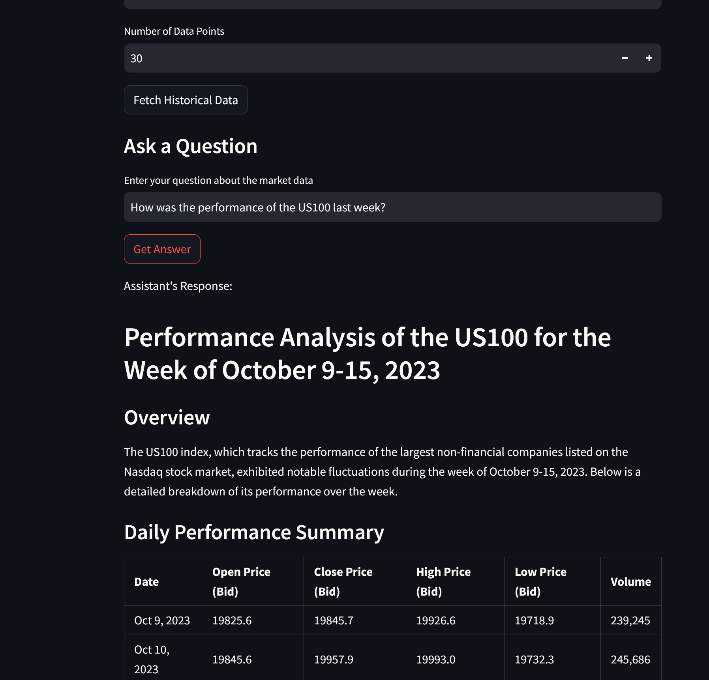

# AI Investing Application


*AI Assistant Tab allowing user interaction with an AI for market insights.*

An AI-driven investing application that leverages real-time market data and machine learning models to simulate investments, predict future market trends, and visualize potential profits using leverage. This application integrates with the Capital.com API to fetch real-time and historical market data and uses AutoGluon for time series prediction.

## Features

- **Real-Time Market Data**: Fetch historical and real-time market data using the Capital.com API.
- **AI Assistant Integration**: Interact with an AI assistant powered by OpenAI's GPT-4 to get insights and answer questions about market data.
- **AutoGluon Time Series Prediction**: Train and deploy time series models to predict future market trends.
- **Investment Simulation**: Simulate investment growth with leverage, including options for monthly investments and stop-loss settings.
- **Interactive Interface**: User-friendly Streamlit interface for easy interaction and visualization.
- **Customizable Parameters**: Adjust initial capital, monthly investment, leverage, stop-loss percentage, and more.

## Installation

### Prerequisites

- Python 3.8 or higher
- pip package manager

### Clone the Repository

```bash
git clone https://github.com/birdhouses/ai-trader.git
cd ai-trader
```

### Install Dependencies

```bash
pip install -r requirements.txt
```

### Set Up Environment Variables

Create a `.env` file in the root directory of the project to store your API credentials. Do **NOT** share this file or upload it to any public repository.

```bash
touch .env
```

Add the following lines to the `.env` file:

```ini
CAPITAL_COM_API_KEY=your_capital_com_api_key
CAPITAL_COM_IDENTIFIER=your_capital_com_identifier
CAPITAL_COM_API_PASSWORD=your_capital_com_password
OPENAI_API_KEY=your_openai_api_key
```

**Note**: Replace `your_capital_com_api_key`, `your_capital_com_identifier`, `your_capital_com_password`, and `your_openai_api_key` with your actual API credentials.

### Obtain Capital.com API Credentials

To use this application, you need to have a Capital.com account and obtain API credentials.

1. Sign up for an account at [Capital.com](https://capital.com/).
2. Navigate to the API section in your account settings.
3. Generate a new API key and note down your identifier and password.

### Obtain OpenAI API Key

To use the AI assistant feature, you need an OpenAI API key.

1. Sign up for an account at [OpenAI](https://platform.openai.com/).
2. Navigate to the **API Keys** section.
3. Generate a new API key.

### Set Up the OpenAI Assistant

The application uses an assistant created in the OpenAI dashboard. You need to create an assistant and add the necessary functions for it to interact with the application.

#### Steps to Create an Assistant:

1. **Access the Assistants Dashboard**:

   Go to the OpenAI platform and navigate to the [Assistants Dashboard](https://platform.openai.com/assistants/overview).

2. **Create a New Assistant**:

   - Click on **"Create Assistant"**.
   - Give your assistant a name, e.g., **"AI Investing Assistant"**.

3. **Add Functions to the Assistant**:

   - In the assistant's settings, locate the **"Functions"** section.
   - For each `.json` file in the `functions` folder of this repository, do the following:
     - Open the `.json` file to view its contents.
     - In the assistant's functions section, click on **"Add Function"**.
     - Provide the function name, description, and parameters as specified in the `.json` file.
     - Repeat this process for each function file.

   The functions define the assistant's capabilities, such as fetching current date and time or retrieving stock data.

4. **Configure the Assistant**:

   - Set the assistant's behavior and other settings as desired.
   - Ensure that the assistant is configured to use the **GPT-4** model with **function calling** capabilities.

5. **Save the Assistant**:

   - After adding all functions and configuring settings, save the assistant.

For more detailed information on creating and configuring assistants, refer to the [OpenAI Assistants Overview](https://platform.openai.com/docs/assistants/overview).

**Important**: The assistant will interact with the application using the functions you've added. It's crucial that the function definitions in the assistant match the implementations in your application.

## Usage

### Running the Application

To run the Streamlit application, execute the following command:

```bash
streamlit run investing.py
```

This will launch the application in your default web browser.

### Application Workflow

1. **Market Data**:

   - Navigate to the **Market Data** tab.
   - Enter the EPIC code of the market you're interested in (e.g., `US100`, `GOLD`, `AAPL`).
   - Select the time resolution.
   - Specify the number of data points.
   - Click on **"Fetch Historical Data"** to retrieve and display the data.
   - View the plotted historical data.

2. **Ask a Question**:

   - In the **Market Data** tab, under **"Ask a Question"**, enter your question about the market data.
   - Click on **"Get Answer"**.
   - The AI assistant will process your question and provide an answer.

3. **Model Training & Prediction**:

   - Navigate to the **Model Training & Prediction** tab.
   - Set the **Prediction Length**.
   - Click on **"Train Model"** to train the AutoGluon time series predictor.
   - Once the model is trained, click on **"Make Prediction"** to generate future market predictions.
   - View the predicted values and plots.

4. **Account Info**:

   - Navigate to the **Account Info** tab.
   - Click on **"Get Account Details"** to view your account information.
   - Click on **"Get Account Preferences"** to view your account preferences.

5. **Positions & Orders**:

   - Navigate to the **Positions & Orders** tab.
   - Click on **"Get Open Positions"** to view your current open positions.
   - Click on **"Get Open Orders"** to view your pending orders.
   - To close a position, enter the **Deal ID** and click on **"Close Position"**.

6. **Place Order**:

   - Navigate to the **Place Order** tab.
   - Select **Order Type** (Market Order or Working Order).
   - Set the order parameters (Direction, Size, Stop Levels, etc.).
   - Click on **"Place Market Order"** or **"Place Working Order"** to execute the order.

7. **Transaction History**:

   - Navigate to the **Transaction History** tab.
   - Enter the **From Date** and **To Date**.
   - Select the **Transaction Type**.
   - Click on **"Get Transaction History"** to view your transaction history.

## Project Structure

```
├── assets                      # Folder containing images for the README
├── modules
│   ├── capital_com_api.py      # Capital.com API client wrapper
│   ├── predictors.py           # AutoGluon time series predictor
│   ├── assistant.py            # Assistant class integrating with OpenAI API
│   └── functions               # Folder containing function definitions in JSON
├── models                      # Directory to store trained models
├── investing.py                # Main Streamlit application
├── requirements.txt            # Python dependencies
├── .env.example                # Example environment variables file
├── .gitignore                  # Git ignore file
└── README.md                   # Project documentation
```

## Dependencies

- **Streamlit**: For building the interactive web application.
- **Pandas**: Data manipulation and analysis.
- **NumPy**: Numerical computing.
- **Matplotlib**: Data visualization.
- **AutoGluon**: Automated machine learning toolkit for time series prediction.
- **Requests**: For making HTTP requests to the Capital.com API.
- **Python-dotenv**: For loading environment variables from a `.env` file.
- **OpenAI**: For interacting with the OpenAI API.
- **Portalocker**: For handling file locking when enforcing API rate limits.

Install all dependencies using:

```bash
pip install -r requirements.txt
```

## Important Notes

- **API Credentials Security**: Ensure that your `.env` file is included in your `.gitignore` file to prevent accidental upload of sensitive API credentials to any public repository.
- **Demo vs. Live Trading**: The application is set to use live trading data (`demo=False`). If you wish to use demo data, set `demo=True` when initializing the `CapitalComAPI` client.
- **Leverage and Risk**: Using leverage amplifies both gains and losses. Be cautious when simulating investments with high leverage and understand the associated risks.
- **Data Privacy**: Be mindful of any personal or sensitive data. Do not share logs or outputs that may contain sensitive information.
- **API Rate Limits**: The Capital.com API enforces a rate limit of 1 request per second. The application handles this by storing the last request time in a file (`rate_limit.json`) and using file locking to enforce the rate limit across multiple instances.
- **Function Definitions**: Ensure that the functions added to the OpenAI assistant match the implementations in the `assistant.py` module. Any discrepancies may lead to unexpected behavior.

## Acknowledgments

- [Capital.com API](https://capital.com/api) for providing access to market data.
- [AutoGluon](https://auto.gluon.ai/) for automated machine learning tools.
- [Streamlit](https://streamlit.io/) for the interactive web application framework.
- [OpenAI](https://openai.com/) for the AI assistant capabilities.
